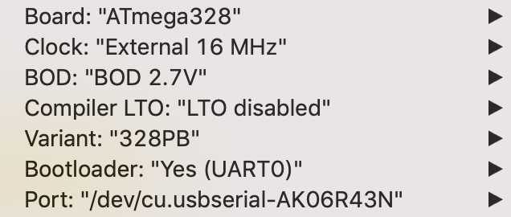

# jamma-streamer

Jamma PCB video recorder and more (hardware)

# Buttons detection

Buttons detection are done using shift registers (8 bits parallel in / serial out such as the 75HC165).
The code used is strongly inspired from the following tutorial:
https://playground.arduino.cc/Code/ShiftRegSN74HC165N

# uSDCARD writing

Source:
https://learn.adafruit.com/adafruit-micro-sd-breakout-board-card-tutorial?view=all

Beware: Arduino pins number and macros you can use in your code are sometimes not equivalent to what you expect when using third party libraries like the one used for SD card... One example is the pin `PB2` (Arduino's pin number 10) used for `CS`. If you use the library's macro `PB2`, it sets the pin to number `2` instead of `10`... This leads to long painful debugging session...

Here is an image with all pin numbers as a reference:


# How to program the ATMEGA328PB

## Fuses

Fuses can be calculated using: https://www.engbedded.com/fusecalc/

More info here: http://www.martyncurrey.com/arduino-atmega-328p-fuse-settings/

## Using arduino bootloader (for debugging and fast upload via IDE)

We are going to use [Minicore](https://github.com/MCUdude/MiniCore) as it supports ATmega328PB used on this project.

---

Use the following procedure:

- First install minicore boards following the [procedure](https://github.com/MCUdude/MiniCore#boards-manager-installation).

Use *arduino as ISP* method to upload the bootloader:
  - configure your IDE to use the source Arduino which will act as a programmer (ISP programmer)
  - upload Arduino ISP sketch to the arduino board to make it act as an *ISP programmer* (available as example sketch from the Arduino IDE)
  - plug all *Jamma Streamer's ICSP* to *Arduino ICSP* except *RST* both sides
  - *RST Jamma Streamer* (from ICSP) to *pin 10* of the Arduino (this will act as the reset pin)
  - plug a 10uF capacitor between Arduino RESET (capacitor +) and GND (capacitor -)

Now configure the board as per the following:


Your arduino is ready for ISP. Now you can configure to burn the bootloader:
  - `Tools > Port`: select the arduino device
  - `Tools > Burn Bootloader`

This should work as expected. From now on, you will be able to upload sketches via *NMA Jamma Streamer* USB port directly!

Fuses consideration:
  - *Minicore* is forked from *Optiboot* (official Arduino UNO bootloader) and is `512 bytes` long.
  - We are using an external crystal oscillator (and not the internal one).
  - `EEPROM` save is enabled (this avoid erasing it at each upload reducing its lifetime).
  - `BOOTSZ1` and `BOOTSZ2` are both disabled because 512 bytes can fit into the minimal 256 words (1 word = 2 bytes).
  - `BOOTRST` is set to indicate we are using a bootloader.
  - `BODLEVEL1` (2.7V) is enabled because why not.

This give the following fuses:
  - low fuse: `0xff`
  - high fuse: `0xd6`
  - extended fuse: `0xf5` (Normally, it would be `0xfd` but after burning, there is a warning so `f5` is a good value)

## Without using arduino bootloader for runtime

We are using Jamma Streamer board ICSP header for this.
No need for a Arduino bootloader, we will be uploading sketch directly via ICSP header !

As I am using Atmega328PB (instead of P), Arduino IDE is not recognizing at first, we need to install this first to have the board available in Arduino’s IDE later on:
https://github.com/nmaupu/ATmega328PB-Testing

---

Plug cables as follow (using Arduino Duemilanove or Mega):

- All ICSP to Arduino ICSP except RST both sides
- RST Jamma Streamer (from icsp) to pin 10 of the arduino
- Plug Arduino via USB to computer and upload ArduinoISP sketch onto it.
- plug a 10uF capacitor between Arduino RESET (capacitor +) and GND (capacitor -)
- select tools > boards > atmega328PB Crystal Clock
- `sketch > Upload using programmer`

This will program the NMA Jamma Streamer ATmega328PB !

## Burn / read fuses (use the crystal oscillator instead of internal one)

Use an external Arduino board to act as an ISP programmer like before:

- All ICSP to Arduino ICSP except RST both sides
- RST Jamma Streamer (from icsp) to pin 10 of the arduino
- Plug Arduino via USB to computer and upload ArduinoISP sketch onto it.
- plug a 10uF capacitor between Arduino RESET (capacitor +) and GND (capacitor -)

To read the fuses, simply execute:
```
avrdude -C /Users/nicolas_maupu/Library/Arduino15/packages/MiniCore/hardware/avr/2.0.5/avrdude.conf \
  -p atmega328pb -c stk500v1 -P /dev/cu.usbmodem141101 -b19200 \
  -U hfuse:r:-:h -U efuse:r:-:h -U lfuse:r:-:h
```

To burn fuses:
```
avrdude -C /Users/nicolas_maupu/Library/Arduino15/packages/MiniCore/hardware/avr/2.0.5/avrdude.conf \
  -v -p atmega328pb -c stk500v1 -P /dev/cu.usbmodem141101 -b19200 \
  -e -Ulock:w:0x3f:m -Uefuse:w:0xF5:m -Uhfuse:w:0xd6:m -Ulfuse:w:0xff:m 
```

To burn the Minicore bootloader:
```
avrdude -C /Users/nicolas_maupu/Library/Arduino15/packages/MiniCore/hardware/avr/2.0.5/avrdude.conf \
  -v -p atmega328pb -c stk500v1 -P /dev/cu.usbmodem141101 -b19200 \
  -Uflash:w:$HOME/Library/Arduino15/packages/MiniCore/hardware/avr/2.0.5/bootloaders/optiboot_flash/bootloaders/atmega328pb/16000000L/optiboot_flash_atmega328pb_UART0_115200_16000000L_B5.hex:i \
  -Ulock:w:0x0f:m 
```

# Thanks

- https://github.com/Shinichi-Ohki/JAMMA_connector_for_eagle
- https://github.com/watterott/wattuino
